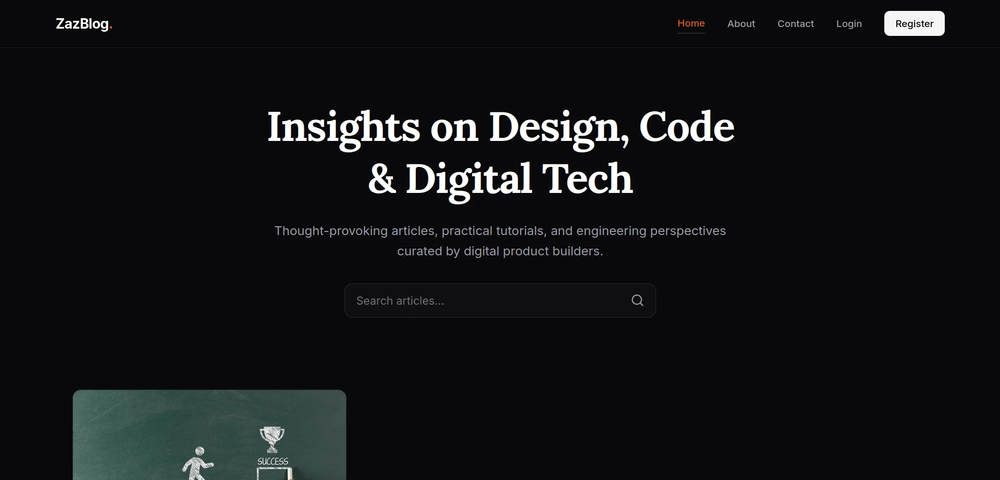
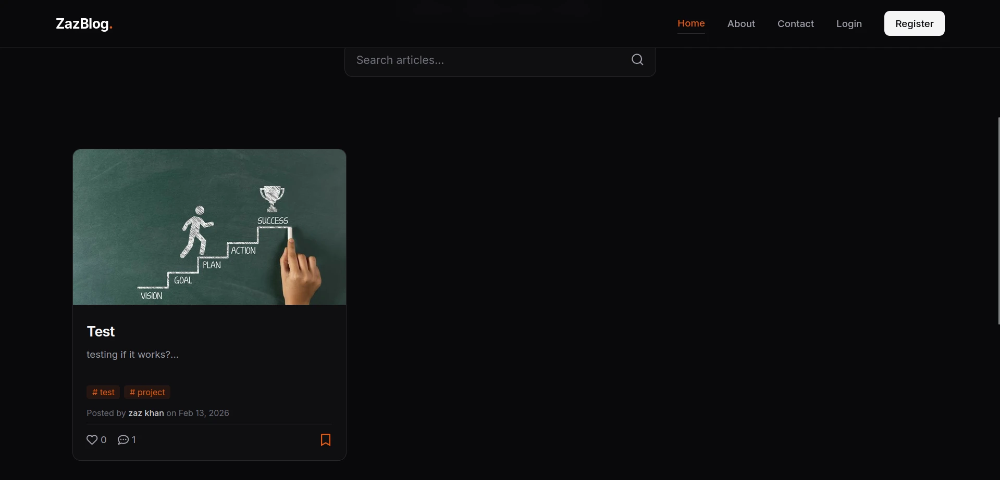
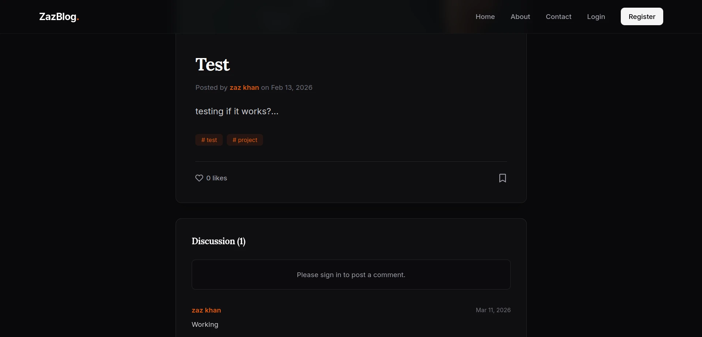
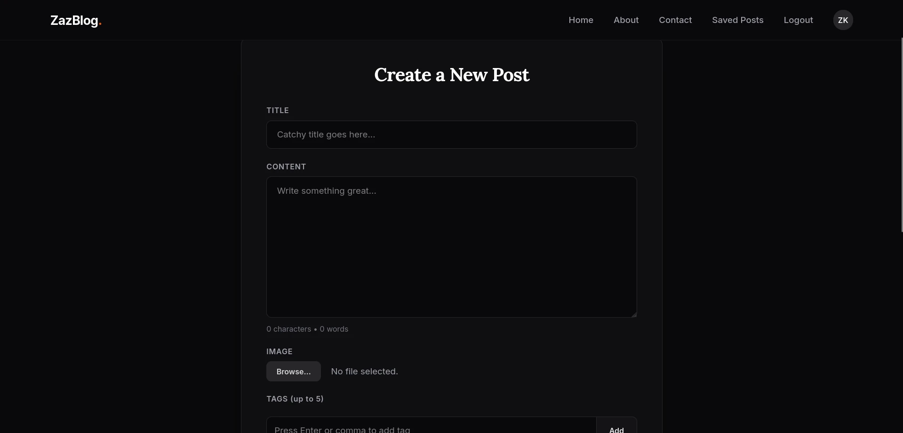
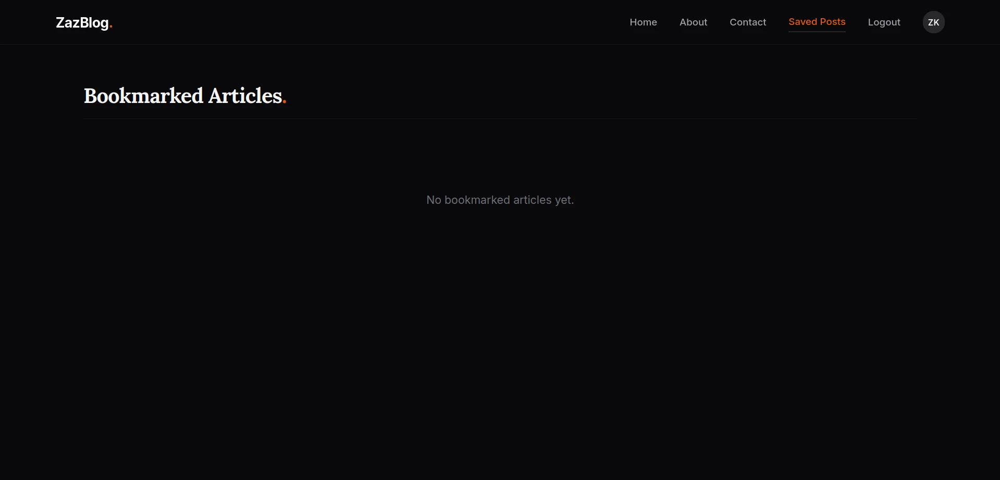
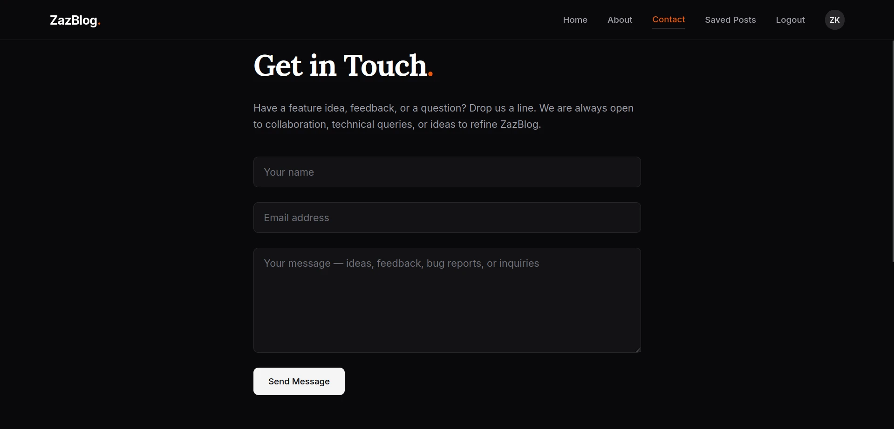

# MERN Blog App

A full-stack blogging platform built with React 19, Node.js, Express, and MongoDB. The system includes manual token-based authentication, dynamic image upload management, bookmark reading lists, user profile administration, and optimized database queries.

## Key Features

- **Authentication System**: Manual user registration and login with passwords hashed using bcrypt. User sessions are secured with JSON Web Tokens (JWT) stored in client-side storage.
- **Dynamic Image Uploads**: Multi-part form processing using Multer middleware. Images are uploaded to Cloudinary, and the returned URL and public ID are saved in MongoDB. The local server removes temporary upload files immediately after upload or failure.
- **Bookmark Management**: Users can save posts to their reading list. Redux Toolkit synchronizes bookmarked states between pages and routes.
- **Social Interaction**: Authenticated users can like posts and add comments. Comments are automatically linked to posts and displayed chronologically.
- **Search and Index Optimization**: Text indexes on posts enable fast search across titles, tags, and content. Compound indexes optimize query performance when fetching author posts sorted by date.
- **Profile Customization**: Users can edit their bio, name, and view their self-authored posts.

## Technical Stack

### Frontend
- **React 19**: UI component model and reactivity.
- **Redux Toolkit**: Centralized state management for authentication status and bookmark lists.
- **Tailwind CSS 4**: Utility-first styling with modern performance configurations.
- **React Router 7**: Declarative client-side routing.
- **Recharts**: Data visualization.
- **Axios**: HTTP requests with request and response interceptors.

### Backend
- **Express**: REST API framework.
- **Mongoose / MongoDB**: Object Document Mapper (ODM) and NoSQL database.
- **JWT (jsonwebtoken)**: Secure stateless authorization.
- **Bcrypt**: Password hashing function.
- **Multer**: Handling multipart/form-data for image uploads.
- **Cloudinary SDK**: Media storage and management.
- **Cors**: Cross-origin resource sharing configuration.
- **Dotenv**: Environment variable loading.

---

## Technical Details

### Database Schemas and Indexes
MongoDB collections are structured using Mongoose schemas:
- **User Schema**: Stores authentication credentials, name, email (unique, indexed), bio, and references to created and saved posts.
- **Post Schema**: Contains post fields (title, content, tags, author, likes, and comments references) and an image object containing `url` and `public_id`.
  - **Text Index**: Created on `title`, `content`, and `tags` to support free-text search queries.
  - **Compound Index**: Created on `{ author: 1, createdAt: -1 }` to speed up queries retrieving user-specific posts ordered by date.
- **Comment Schema**: Stores comment content with index references to the respective post and author.

### API Authentication Flow
1. The user logs in with email and password.
2. The server compares the password using bcrypt.
3. Upon success, a JWT is signed with the user's ID and returned to the client.
4. Axios request interceptors extract the JWT from local storage and attach it to the `Authorization` header of outgoing requests.
5. If the backend returns a `401 Unauthorized` status (e.g., token expired), response interceptors clear local storage and redirect the browser to the login page.

---

## Local Development Setup

### Prerequisites
- Node.js (v18 or higher)
- npm or yarn
- MongoDB instance (local or Atlas)
- Cloudinary account

### 1. Clone the Repository
```bash
git clone https://github.com/aitezazdev/MERN-Blog-App.git
cd MERN-Blog-App
```

### 2. Configure Backend
1. Navigate to the backend directory:
   ```bash
   cd backend
   ```
2. Install dependencies:
   ```bash
   npm install
   ```
3. Create a `.env` file in the `backend/` directory:
   ```env
   PORT=5000
   MONGO_URI=mongodb://localhost:27017/blog-app
   JWT_SECRET=your_jwt_secret_key
   CLOUDINARY_CLOUD_NAME=your_cloudinary_cloud_name
   CLOUDINARY_API_KEY=your_cloudinary_api_key
   CLOUDINARY_API_SECRET=your_cloudinary_api_secret
   ```
4. Start the backend development server:
   ```bash
   npm run dev
   ```

### 3. Configure Frontend
1. Navigate to the frontend directory:
   ```bash
   cd ../frontend
   ```
2. Install dependencies:
   ```bash
   npm install
   ```
3. Create or update the `.env` file in the `frontend/` directory:
   ```env
   VITE_API_URL=http://localhost:5000
   ```
4. Start the client application:
   ```bash
   npm run dev
   ```

---

## Visual Preview

The following screenshots illustrate the design and core interfaces of the application.

### Home Interface


### Post View


### Profile Details


### User Settings


### Saved Reading List


### Authentication

